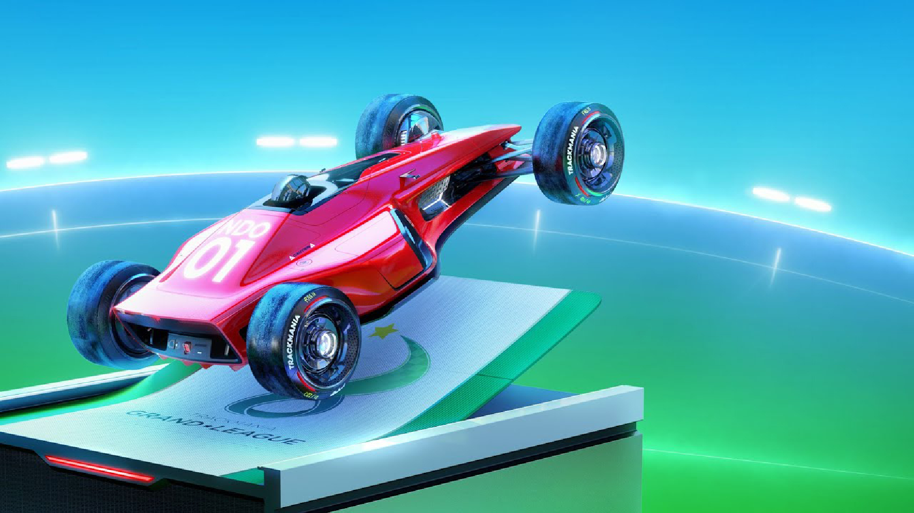
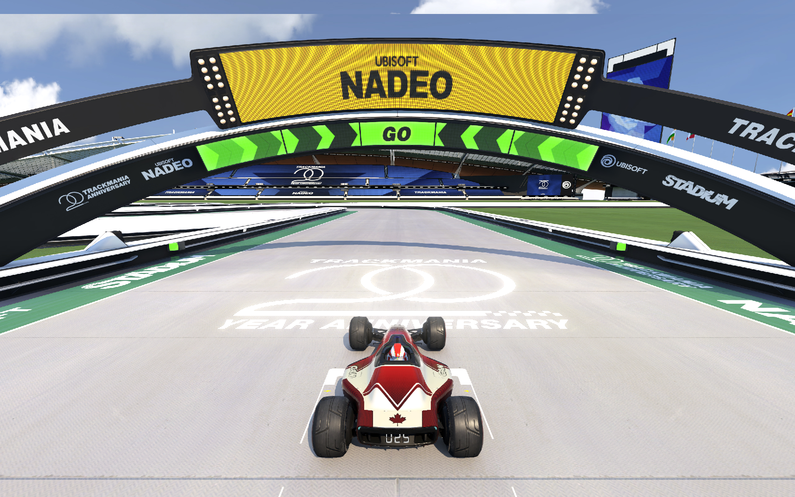
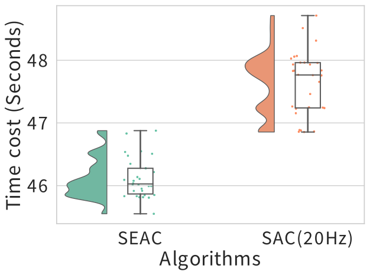

# TMRL_MOSEAC
This project is for applying the idea of elastic time step with reinforcement learning under 
[tmrl](https://github.com/trackmania-rl/tmrl) framework.

This repo is for the paper [Reinforcement Learning with Elastic Time Step](https://arxiv.org/abs/2402.14961). About the 

The tmrl framework can establish a communication link between game 
[Trackmania](https://www.trackmania.com/?rub=home&lang=en) to your local machine though 
[OpenPlant](https://openplanet.dev/).

The tmrl framework is a powerful Multi-threaded data transfer framework, allowing users to 
train multi-threaded. However, Trackmania is not supposed to run multi-threaded. In other 
words, one machine can only launch one game at the same time.

Therefore, our code will be used for single-thread training on a Windows machine.

## Prerequisites
- Windows 10 / 11
- Python >= 3.7
- A NVIDIA GPU (required only if you plan to train your own AI, better latest the Ampere framework to enable the 
latest driver and Cuda version.)

### If using Anaconda on Windows:
We recommend installing the conda version of `pywin32`:

`
conda install pywin32
`

## Installation

The following instructions are for installing `tmrl` with support for the TrackMania 2023 video game.

You will first need to install [TrackMania 2023](https://www.trackmania.com/?rub=home&lang=en) and also a small 
community-supported utility called [Openplanet](https://openplanet.dev/) for TrackMania (the Gymnasium environment 
needs this utility to compute the reward).

Ensure you install the `Visual C++ runtime` before installing the OpenPlanet. You can download it 
[here](https://aka.ms/vs/16/release/vc_redist.x64.exe) for 64bits versions of Windows.

Then you can install `tmrl` framework easily by:

`
pip install tmrl
`

## Deploy the code

### Preparing

Once you have installed the `tmrl` framework, you should set up your own Cuda environment.

You need to install the driver by checking the [official website](https://www.nvidia.com/Download/index.aspx?lang=en-us) 
for the latest driver. Then, install [cuda toolkit](https://developer.nvidia.com/cuda-downloads) with its related
[cuDNN](https://developer.nvidia.com/cudnn). 

After that, you need to install `pytorch` with the guidance of their [official website](https://pytorch.org/).

We tested our code with these hardware and software conditions:
- Nvidia RTX 4070
- Driver version: 535.98
- Cuda version: 11.8
- cuDNN version: 8.7.0
- Pytorch version: 2.1.0+cu118

Our code should work with a higher version. Those conditions are just for reference.

### Install the requirements

Once you have the development environment prepared, you can download our code though:

`
git clone https://github.com/alpaficia/TMRL_SEAC
`

Then copy the `config.json` file to the tmrl config folder. It should locate at `C:\user\your_name\TmrlData\config`.

### Install the map and dependence

Load the tmrl-test track into your TrackMania game:

- Navigate to your home folder `(C:\Users\username\)`, and open `TmrlData\resources`
- Copy the `tmrl-test.Map.Gbx` file into `...\Documents\Trackmania\Maps\My Maps`.

Next, you need to install the requirement package by:

`
cd Path_To_Your_Code
pip install -r requirement.txt
`
## Launch the training code

### Game preparation

- Launch TrackMania 2023
- In case the OpenPlanet menu is showing in the top part of the screen, hide it using the `f3` key
- Launch the `tmrl-test` track. This can be done by selecting `create > map editor > edit a map > `tmrl-test,` selecting a map, and hitting the green flag. You should see a window like this:

- Set the game in windowed mode. To do this, bring the cursor to the top of the screen, and a drop-down menu will show 
Hit the window icon.
- Bring the TrackMania window to the top-left corner of the screen. On Windows 10 / 11, it should automatically fit  
a quarter of the screen (NB: the window will automatically snap to the top-left corner and get sized properly when you 
start the training).
- Hide the ghost by pressing the g key.

### Start Training

Once you start the game, you can launch a new terminal and cd to your code path. Then:

`
python MOSEAC_main.py
`

The training process is based on real-time data. So, performance is highly related to your PC's hardware products.

If you don't see the log outputs many "time out," which means your PC is good enough to process with the current time 
parameters setting.

If you see many "time out" warnings during this training, it means your CPU IPC or RAM is not good enough for this 
training. Our control rate is default set within [5, 30] Hz. You can change them by:

`
python3 SEAC_main.py --min_time=YOUR_VALUES --max_time=YOUR_VALUES`
`
To meet your hardware productions' performance.

Our code was tested on the CPU: i5-13600K, RAM: DDR4 3200 MHz, and GPU: Nvidia RTX 4070. If you keep the default parameters, you 
probably see the agent is able to pass the first curve around 8 hours.

## More details and settings

The Trackmania game also provides lidar data. If you would like to do more, please refer to the repo 
[here](https://github.com/trackmania-rl/tmrl/blob/master/readme/get_started.md#load-the-tmrl-test-track-into-your-trackmania-game).

## Results

We compared our elastic method VS. fixed rate method (20 Hz) baseline.

The chart of consumption of steps is here:

The chart of consumption of time is here:

The video is available [here](https://youtu.be/kEE0XEQueUM).

## License
MIT

## Contact Information
Author: Dong Wang (dong-1.wang@polymtl.ca), Giovanni Beltrame (giovanni.beltrame@polymtl.ca)

You are also welcome to contact [MISTLAB](https://mistlab.ca) for more fun and practical robotics and AI-related projects and 
collaborations. :)

